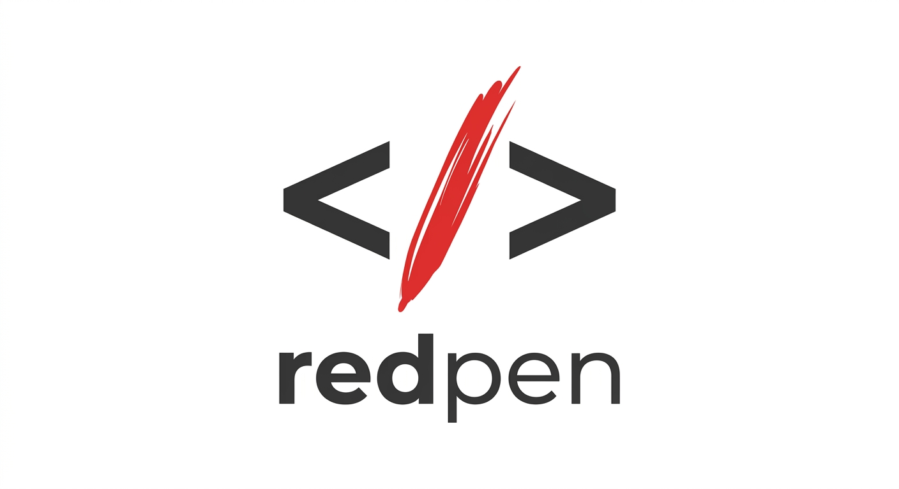
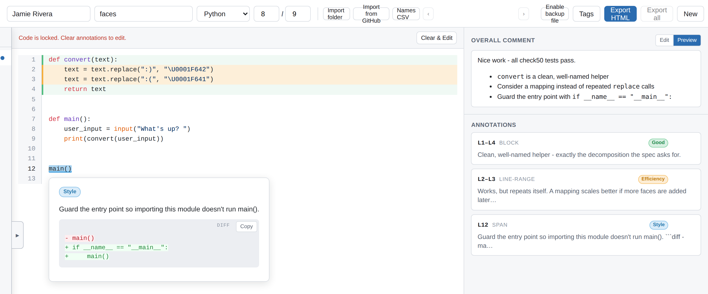
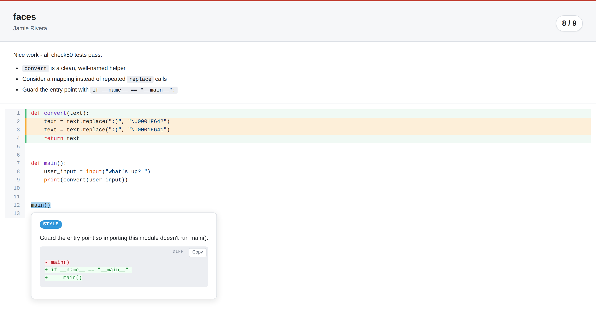

  

# redpen

A lightweight, zero-setup tool for grading student code submissions with inline annotations. Designed for teachers to provide clear, Genius.com-style inline feedback that is easy to read, completely self-contained, and works fully offline.

## Overview

**redpen** operates in two simple modes:
- **Author mode** — The grading app itself. A teacher uses this to load student code, highlight specific regions, write markdown comments, add tags, and export the graded file.
- **Viewer mode** — The exported HTML file. This is a self-contained, read-only document that the student opens in any browser to see their grade and click on highlights to read feedback.

### Author mode — grading

A CS50 `faces.py` submission mid-grading: block, line-range, and span annotations with color-coded tags, a feedback tooltip with a suggested change, the annotation list, and the overall comment preview.

### Viewer mode — what the student receives

The same submission as the exported, self-contained HTML file: score badge, overall feedback, highlighted code, and click-to-open tooltips.

## Features

- **Inline Annotations**: Highlight exact characters (spans), multiple lines, or entire structural blocks of code.
- **Markdown Support**: Write formatting, lists, links, and code snippets inside your comments.
- **Code Suggestions**: Attach a before/after change suggestion to any comment — it renders as a colorized diff.
- **Color-coded Tags**: Categorize your feedback (e.g., "Logic", "Style", "Good") with customizable color tags.
- **Grade a Whole Class**: Import a folder of submissions, GitHub file URLs, or CS50 (submit50) submissions into a queue and step through students one by one.
- **Names CSV**: Map GitHub usernames to real student names with a simple CSV.
- **Batch Export**: Export every graded submission in the queue as a zip of HTML files in one click.
- **Autosave**: Grading work is continuously saved in the browser (with an optional on-disk backup file) and can be restored after a crash or refresh.
- **Self-contained Export**: Generates a single HTML file containing the code, formatting, and feedback—with no external dependencies.
- **Fully Offline**: No servers, no accounts, and no student data leaving your machine.
- **Zero Setup**: No installation required. Just open the app in your browser and start grading.

## How to Use

### 1. Starting redpen
There is no installation required. To use redpen:
1. Download or clone this repository to your computer.
2. Double-click the `index.html` file to open it in any modern web browser (Chrome, Firefox, Safari).

### 2. Loading Submissions
Pick whichever fits your workflow:
- **Paste Code**: Copy a single student's source code and paste it into the main text area. Choose the language (Python, JavaScript, HTML, or CSS) in the top bar.
- **Import Folder**: Click **"Import folder"** and pick a folder of student files. Each file becomes a queue entry; filenames like `username_project.py` prefill the student and assignment fields.
- **Import from GitHub**: Click **"Import from GitHub"** and either paste file URLs (public repos need no token; private repos need a personal access token), or use one of the two CS50 modes to pull submit50 submissions — manually by org/slug/usernames, or from the JSON export downloaded from submit.cs50.io (which also prefills real names and check50 scores). Tokens are used only for the fetch and are never saved or exported.
- **Names CSV**: Optionally click **"Names CSV"** to load a `username,real name` CSV so queue entries show real student names.

With more than one submission loaded, use the **‹ ›** arrows in the top bar or the queue drawer at the bottom of the screen to switch between students.

### 3. Grading a Submission
1. **Set Details**: Fill out the student's name, assignment name, programming language, and the final score in the top bar (imports prefill most of this).
2. **Add Annotations**:
   - Select the text you want to comment on with your mouse.
   - Click the floating **"+ Comment"** button that appears.
   - Choose the annotation type (span, line range, or block), write your feedback in markdown, and apply relevant tags.
   - Optionally click **"+ Add code suggestion"** to attach a before/after diff.
3. **Manage Tags**: Click **"Tags"** in the top bar to rename, recolor, delete, or create tags.
4. **General Feedback**: You can also provide an overall assignment comment in the right sidebar.

Your work autosaves to the browser as you grade — if the tab closes or crashes, a restore banner offers your draft back on the next visit. For extra safety, click **"Enable backup file"** (Chrome/Edge) to keep a file on disk continuously in sync.

### 4. Exporting & Sharing
1. Once you are finished grading, click the **"Export HTML"** button in the top right.
2. A single HTML file (e.g., `studentname_assignment_redpen.html`) will be downloaded.
3. Send this exported file to the student!

Grading a queue? **"Export all"** downloads every submission as one zip of HTML files.

### 5. Viewing Feedback (Student)
When the student receives the file:
1. They double-click it to open it in their own browser — no internet needed.
2. They will see their code with highlighted sections.
3. Clicking on any highlighted text will pop up a tooltip containing the teacher's exact feedback.
4. Printing the page turns the annotations into numbered footnotes.
