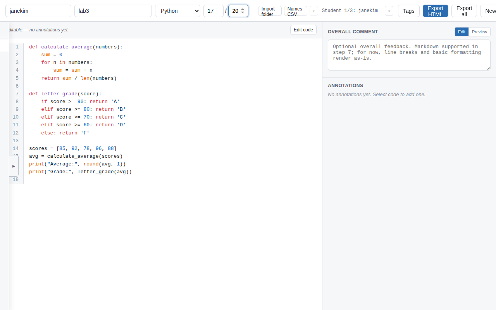
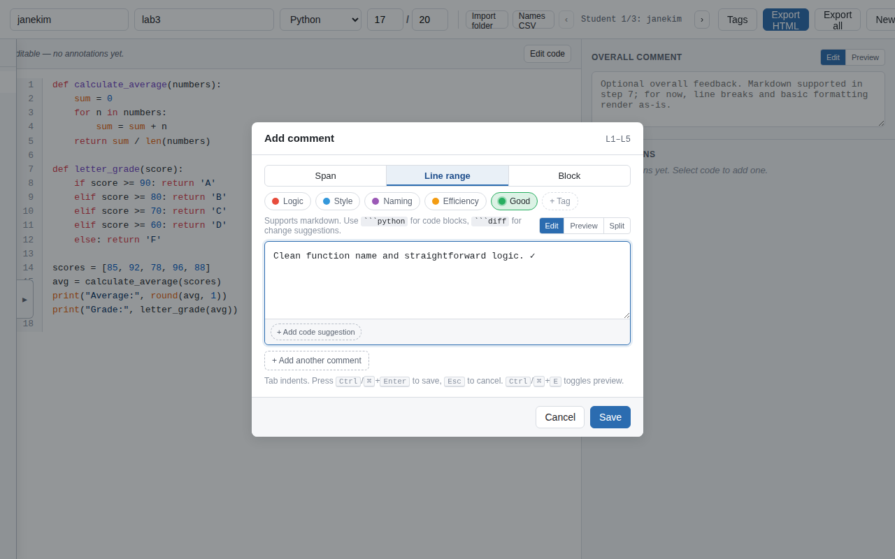
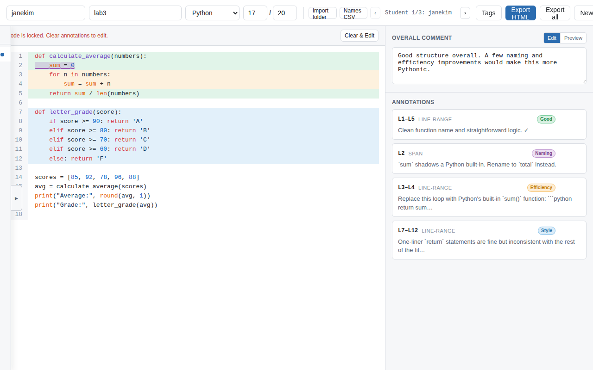
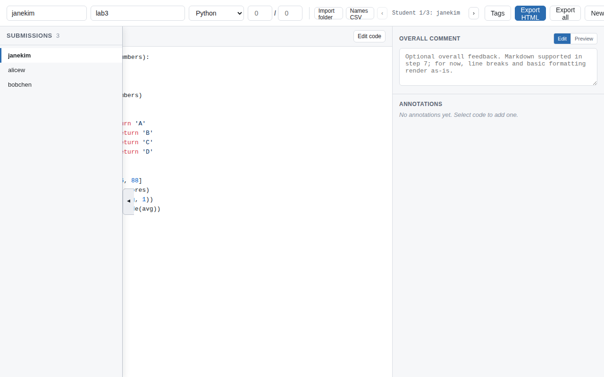
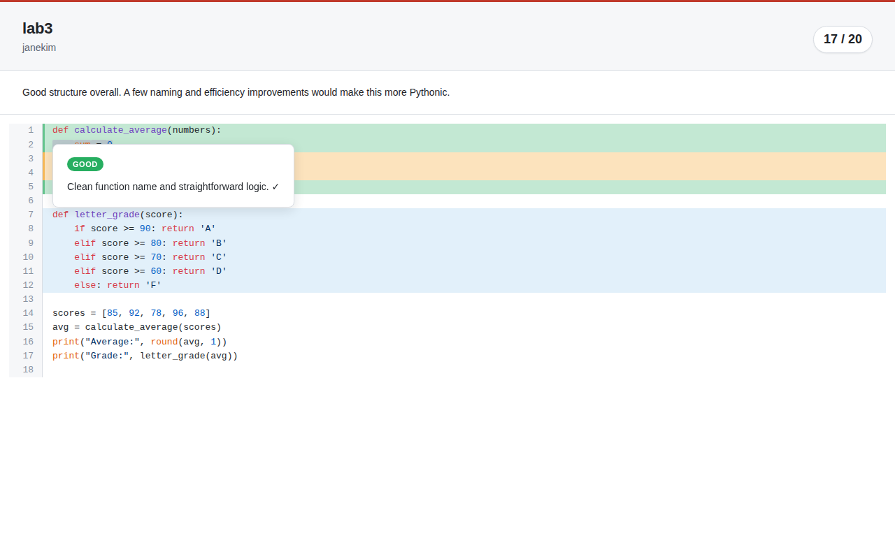

  

# redpen

A lightweight, zero-setup tool for grading student code submissions with inline annotations. Designed for teachers to provide clear, Genius.com-style inline feedback that is easy to read, completely self-contained, and works fully offline.

## Overview

**redpen** operates in two simple modes:
- **Author mode** — The grading app itself. A teacher uses this to paste or import student code, highlight specific regions, write markdown comments, add tags, and export graded files.
- **Viewer mode** — The exported HTML file. A self-contained, read-only document that the student opens in any browser to see their grade and click on highlights to read feedback.

## Features

- **Inline Annotations**: Highlight exact characters (spans), multiple lines, or entire structural blocks of code.
- **Markdown Support**: Write formatting, lists, links, and fenced code blocks inside your comments.
- **Color-coded Tags**: Categorize feedback (e.g. "Logic", "Style", "Good") with customizable color tags.
- **Folder Import**: Drop in a whole assignment folder at once — each student file becomes a queued submission, pre-filled with their name and the assignment name parsed from the filename.
- **CSV Name Mapping**: Pair folder import with a `username,realname` CSV to replace raw usernames with real student names automatically.
- **Queue Grading**: A collapsible drawer lists all submissions. Click any entry to jump to that student; an indicator dot marks submissions that already have annotations.
- **Batch Export**: Grade everyone, then export the whole queue as a single zip with one click.
- **Self-contained Export**: Each graded file is a single HTML with no external dependencies — code, styles, and feedback all in one.
- **Fully Offline**: No servers, no accounts, no data leaving your machine.
- **Zero Setup**: No installation required. Open `index.html` and start grading.

---

## How to Use

### 1. Starting redpen

No installation required:
1. Download or clone this repository.
2. Double-click `index.html` to open it in any modern browser (Chrome, Firefox, Safari).

---

### 2. Single submission (paste workflow)

1. Fill in the **student name**, **assignment name**, **language**, and **score** in the top bar.
2. Paste the student's code into the main text area and click **Render code**.

3. **Add annotations** — select any text in the rendered code and click the floating **+ Comment** button that appears.

4. Write your feedback, pick a tag, and press **Ctrl/⌘ + Enter** to save. Repeat for every region you want to comment on.
5. Optionally write an **Overall comment** in the right sidebar.

6. Click **Export HTML** — a single file (e.g. `janekim_lab3_redpen.html`) will download. Send it to the student.

---

### 3. Batch workflow (whole class at once)

Redpen can import an entire assignment folder and let you grade every student in one session.

**File naming convention:** `{username}_{assignment}.{ext}`
Examples: `janekim_lab3.py`, `bobchen_lab3.js`

#### Import a folder

1. Click **Import folder** in the top bar and pick the directory containing your students' files.
2. Each file becomes a queued submission. The queue drawer slides open on the left showing everyone's name.

3. Optionally click **Names CSV** and supply a `username,realname` CSV to replace raw usernames with real names.

#### Grade each submission

- Click any name in the drawer (or use the **‹ ›** arrows) to switch submissions. The code loads and renders instantly.
- The topbar counter shows your progress (`Student 2/3: bobchen`).
- A dot appears next to each name once you add at least one annotation.

#### Export everything

Click **Export all** — redpen zips every graded HTML into a single `redpen_batch_YYYY-MM-DD.zip` for you to distribute.

---

### 4. Viewing feedback (student)

1. The student opens the exported `.html` file in any browser — no internet required.
2. Highlighted regions are clickable; a tooltip shows the tag and full markdown-rendered feedback.

---

## Tags

Five tags are included by default:

| Tag | Color |
|---|---|
| Logic | Red |
| Style | Blue |
| Naming | Purple |
| Efficiency | Orange |
| Good | Green |

Click **Tags** in the top bar to add, rename, recolor, or remove tags at any time.
